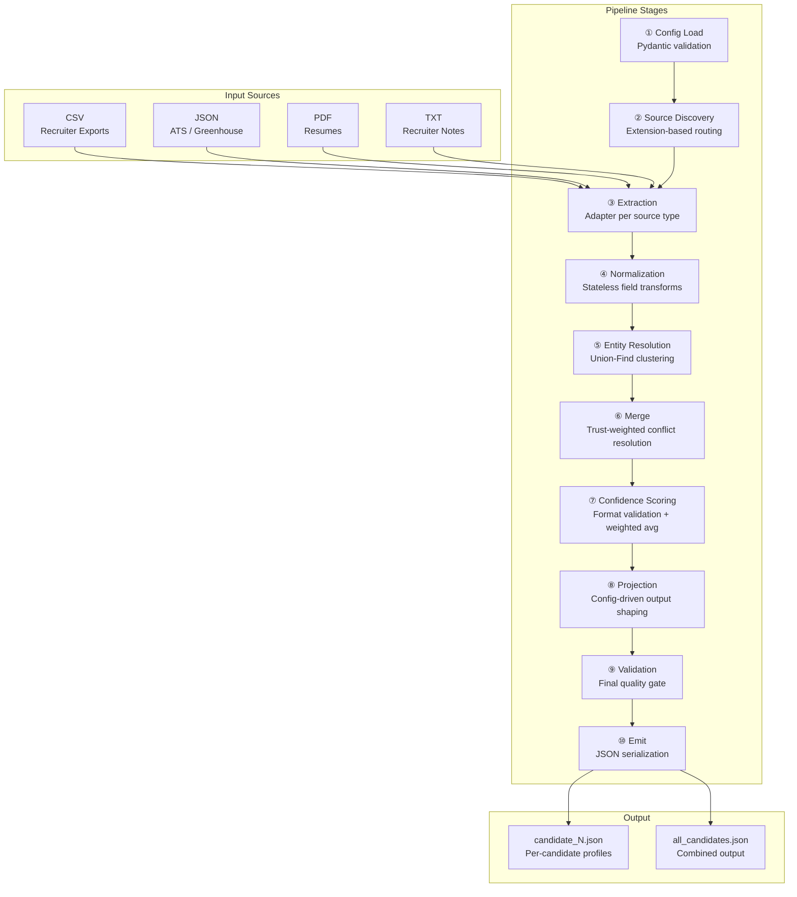
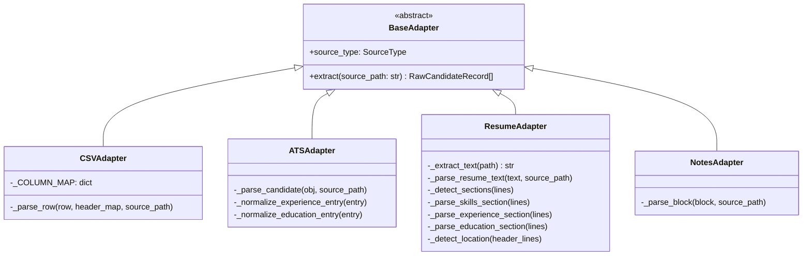
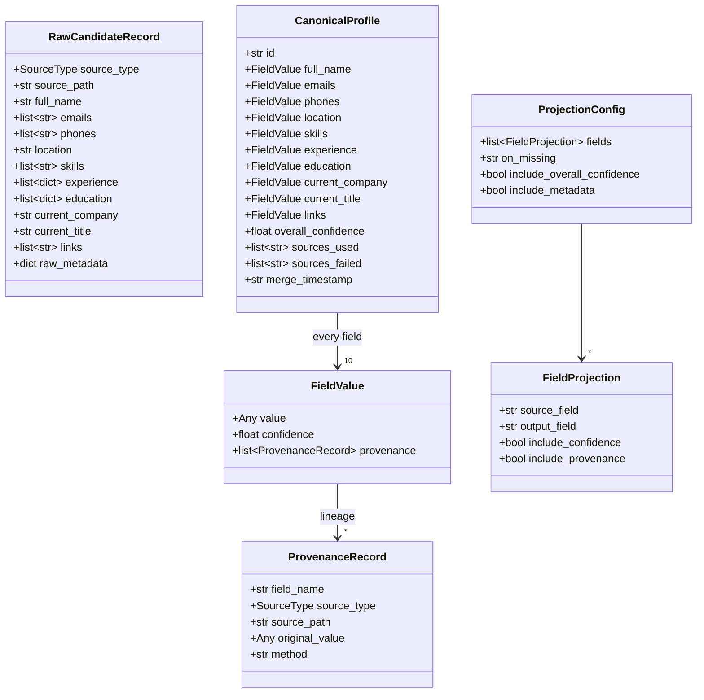
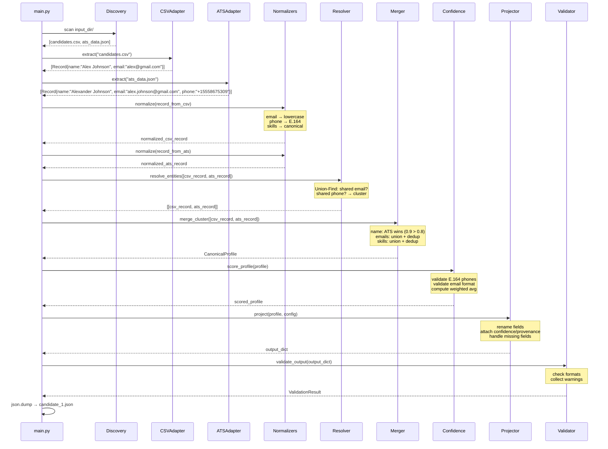

# Multi-Source Candidate Data Transformer — Engineering Design Document

**Author:** Swetanjana Maity
**Status:** Implemented  
**Last Updated:** June 2026

---

## 1. Executive Summary

### Problem

Candidate data arrives from sources with no shared schema — ATS JSON exports, recruiter CSV spreadsheets, PDF resumes, and free-text recruiter notes. The same candidate appears under different name spellings, phone formats, and skill labels across these sources. There is no single source of truth.

The task: build a pipeline that ingests all of them, identifies which records describe the same person, merges them into a single canonical profile, and produces clean JSON output where every field carries a confidence score and a traceable lineage back to its origin.

### Solution

A 10-stage deterministic data transformation pipeline. No LLMs, no probabilistic models, no external API calls. Every output is reproducible given the same inputs. Every resolved value records which source it came from and why it was chosen.

### Design Principles

| Principle | Implication |
|---|---|
| **Determinism** | Same input → same output. No randomness, no model inference, no network calls. |
| **Explainability** | Every field carries provenance. A downstream engineer can trace any value to its source file. |
| **Honest emptiness** | Missing fields are `null` with `confidence: 0.0`. The system never invents data. |
| **Separation of concerns** | Extraction, normalization, resolution, merging, scoring, and projection are independent stages with clean interfaces. |
| **Open/Closed principle** | New source types require one new file and one registry entry. Zero changes to existing code. |

---

## 2. Functional Requirements

| ID | Requirement |
|---|---|
| FR-1 | Ingest candidate data from CSV, JSON (ATS), PDF (resume), and TXT (recruiter notes) sources |
| FR-2 | Normalize contact info (phone → E.164, email → lowercase), dates (→ YYYY-MM), locations (→ ISO country), skills (→ canonical names) |
| FR-3 | Identify and group records describing the same candidate across sources |
| FR-4 | Merge grouped records into a single canonical profile with documented conflict resolution |
| FR-5 | Assign per-field and per-profile confidence scores |
| FR-6 | Record provenance (source file, original value, resolution method) for every resolved field |
| FR-7 | Project the canonical profile into a configurable output shape at runtime |
| FR-8 | Validate final output for format correctness |
| FR-9 | Emit one JSON file per candidate plus a combined file |

---

## 3. Non-Functional Requirements

| Requirement | How it is met |
|---|---|
| **Determinism** | No LLM calls, no randomness, no network I/O. Pure functions throughout the normalization and merge layers. |
| **Maintainability** | Each pipeline stage is a separate module with a defined input/output contract. Stages can be tested, debugged, and replaced independently. |
| **Extensibility** | Adapter pattern with abstract base class. Adding a new source format requires one new file — no changes to the pipeline orchestrator. |
| **Explainability** | `ProvenanceRecord` attached to every resolved field. Provenance is part of the data model, not a bolted-on feature. |
| **Fault tolerance** | Per-adapter and per-record error isolation. One bad file or malformed row does not stop the pipeline — it is logged, added to `sources_failed`, and processing continues. |
| **Performance** | Pre-compiled regex patterns (compiled once at import, reused across calls). Union-Find with path compression for near-constant-time entity resolution. |
| **Testability** | All normalizers are pure functions. Adapters, mergers, and projectors are independently testable with synthetic inputs. 5 test modules with parametrized edge cases. |

---

## 4. High-Level Architecture



### Layer Responsibilities

| Layer | Package | Responsibility | Boundary |
|---|---|---|---|
| **Schema** | `schema/` | Data contracts for the entire pipeline | Defines `RawCandidateRecord`, `CanonicalProfile`, `FieldValue`, `ProvenanceRecord`, `ProjectionConfig` |
| **Adapters** | `adapters/` | Source-specific extraction | Reads one file format → produces `RawCandidateRecord[]`. No normalization, no merging. |
| **Normalizers** | `normalizers/` | Field standardization | Transforms raw values into standard formats. Pure functions, no side effects. |
| **Engine** | `engine/` | Core data processing | Entity resolution, merging, confidence scoring, projection |
| **Validators** | `validators/` | Output quality assurance | Checks format correctness, collects issues without raising |
| **Utils** | `utils/` | Shared infrastructure | Constants, enums, pre-compiled regex patterns |
| **Orchestrator** | `main.py` | Pipeline sequencing | CLI entry point, calls stages in order, handles errors |
| **Web UI** | `app.py` | Presentation layer | Thin Streamlit wrapper, calls `main.py` via subprocess |

> **Engineering note:** The Streamlit UI deliberately calls `main.py` via `subprocess.run()` rather than importing pipeline functions directly. This proves the engine is fully decoupled from any presentation layer — the UI is a client of the CLI, not a wrapper around library code.

---

## 5. Detailed Module Design

### 5.1 `adapters/` — Source-Specific Extraction

**Purpose:** Convert each source format into the pipeline's common intermediate representation (`RawCandidateRecord`).

**Why it exists:** Each source has a fundamentally different structure. CSV has rows and columns. ATS JSON has nested objects with vendor-specific field names. PDFs are unstructured prose. Recruiter notes are free text with no schema. Pushing source-specific parsing into isolated adapters keeps the rest of the pipeline format-agnostic.



| Adapter | Input | Strategy | Trust Weight |
|---|---|---|---|
| `CSVAdapter` | `.csv` | `csv.DictReader` + 30+ header synonym map. Maps `"e-mail"`, `"applicant name"`, `"competencies"`, etc. to canonical field names. One record per row. | 0.8 |
| `ATSAdapter` | `.json` | Handles arrays and single objects. Traverses nested `contact.email`, `contact.phone` paths. Normalizes experience/education entry keys. | 0.9 |
| `ResumeAdapter` | `.pdf` | `pypdf` text extraction → regex-based field detection. Detects 10 section types. First non-contact line = candidate name (resume convention). | 0.7 |
| `NotesAdapter` | `.txt` | Splits text into candidate blocks by `---`/`***` separators or triple newlines. Regex extraction for structured fields (`"Skills: Python, ML"`, `"Works at Google"`). | 0.5 |

**Inputs:** File path (string)  
**Outputs:** `list[RawCandidateRecord]` — zero or more records per file  
**Invariant:** Adapters never raise on bad input. Parse failures return an empty list.

**Registration:** Adapters are registered in `_ADAPTER_REGISTRY` (a `dict[SourceType, type[BaseAdapter]]`). The `get_adapter()` factory selects the correct adapter based on file extension via `EXTENSION_SOURCE_MAP`.

---

### 5.2 `normalizers/` — Stateless Field Standardization

**Purpose:** Transform raw field values into standard formats so that downstream matching and merging operate on consistent representations.

**Why it exists:** Without normalization, `"(555) 867-5309"` and `"+15558675309"` would be treated as different phone numbers, and `"ML"` and `"Machine Learning"` would appear as separate skills. Normalization eliminates surface-level variation before entity resolution.

| Module | Transform | Library/Method | Example |
|---|---|---|---|
| `phone.py` | Raw → E.164 | `phonenumbers` library | `"(555) 867-5309"` → `"+15558675309"` |
| `date.py` | Raw → YYYY-MM | Regex cascade (month-name, numeric, ISO) | `"January 2022"` → `"2022-01"` |
| `location.py` | Raw → structured with ISO country | Country alias map + US state detection | `"Bangalore, India"` → `"Bangalore, IN"` |
| `skills.py` | Raw → canonical name | Alias lookup table | `"k8s"` → `"Kubernetes"`, `"reactjs"` → `"React"` |

**Inputs:** `RawCandidateRecord` (messy)  
**Outputs:** `RawCandidateRecord` (same object, fields normalized in-place)  
**Design constraint:** All normalizers are pure functions — no side effects, no shared state. Each is independently unit-testable.

The orchestrating function `normalize_record()` applies all normalizations to a single record:

```
emails    → lowercase + strip whitespace
phones    → E.164 (invalid dropped)
skills    → canonical alias map + dedup
location  → parsed to {city, region, country_code}
dates     → YYYY-MM across experience entries
name      → whitespace strip
company   → whitespace strip
title     → whitespace strip
```

> **Why these standards?** E.164 is the ITU international telephone numbering standard — unambiguous and machine-comparable. ISO-3166-1 alpha-2 eliminates country name variations (`"USA"`, `"United States"`, `"US"` → `"US"`). YYYY-MM is the natural precision level for employment dates.

---

### 5.3 `engine/` — Core Processing

**Purpose:** The algorithmic core of the pipeline — entity resolution, merging, confidence scoring, and output projection.

| Module | Responsibility |
|---|---|
| `resolver.py` | Groups normalized records into candidate clusters using Union-Find |
| `merger.py` | Merges each cluster into one `CanonicalProfile` with conflict resolution and provenance |
| `confidence.py` | Adjusts per-field confidence based on format validation; computes overall profile score |
| `projector.py` | Reshapes `CanonicalProfile` into the output format defined by the runtime config |

Each module is detailed in the Algorithms section below.

---

### 5.4 `validators/` — Output Quality Gate

**Purpose:** Verify that projected output is well-formed before writing to disk.

**Why it exists separately from the projector:** The projector's job is shaping data. The validator's job is catching errors. Separating them means we can change output format rules without touching projection logic, and vice versa.

**Design choice:** The validator collects issues into a `ValidationResult` dataclass rather than raising exceptions. This allows the caller to decide whether to emit a partial result with warnings or reject the output entirely.

**Checks performed:**

| Check | Severity | Pattern |
|---|---|---|
| Confidence is a number | Error | `isinstance(value, (int, float))` |
| Confidence in `[0.0, 1.0]` | Warning | Range check |
| Phone in E.164 format | Warning | `^\+\d{7,15}$` |
| Email format | Warning | Standard email regex |
| Empty string field | Warning | `.strip() != ""` |

---

### 5.5 `schema/` — Data Contracts

**Purpose:** Define the data structures that form the pipeline's internal API.

| Model | Role | Implementation |
|---|---|---|
| `RawCandidateRecord` | Intermediate representation between adapters and normalizers | `dataclass` — lightweight, mutable |
| `CanonicalProfile` | Final merged profile for one candidate | `dataclass` — every field is a `FieldValue` |
| `FieldValue` | Wraps a resolved value with confidence + provenance | `dataclass` |
| `ProvenanceRecord` | Lineage metadata for one field resolution | `dataclass` |
| `ProjectionConfig` | Runtime output configuration | `pydantic.BaseModel` — strict validation |
| `FieldProjection` | Per-field projection settings | `pydantic.BaseModel` |

> **Why Pydantic only at the config boundary?** Internal models use `dataclasses` — no runtime validation overhead on hot paths. Pydantic is reserved for `ProjectionConfig` because that's an external trust boundary: user-supplied JSON that must be validated strictly before the pipeline trusts it.

---

### 5.6 `utils/` — Shared Infrastructure

| Module | Contents |
|---|---|
| `constants.py` | `SourceType` enum, `SOURCE_TRUST_WEIGHTS`, `EXTENSION_SOURCE_MAP`, `FIELD_CRITICALITY`, confidence constants (`AGREEMENT_BONUS`, `FORMAT_FAILURE_PENALTY`, `MAX_CONFIDENCE`) |
| `patterns.py` | Pre-compiled regex patterns for email, phone, URL, GitHub URL, LinkedIn URL, month-year dates, numeric dates, ISO dates, year-only, resume section headers |

> **Why pre-compiled patterns?** Regex compilation is expensive relative to matching. Compiling once at import time and reusing across all adapter and normalizer calls avoids redundant work. It also eliminates duplicated regex strings — a pattern change requires editing exactly one line.

---

## 6. Canonical Data Model



The central design decision: every field on `CanonicalProfile` is a `FieldValue`, not a bare value. This makes confidence and provenance intrinsic to the data model. There is no separate lookup table mapping field names to their scores — the score travels with the data.

**`ProvenanceRecord.method` values:**

| Method | Meaning |
|---|---|
| `"direct"` | Single source provided this field — no conflict to resolve |
| `"agreement"` | Multiple sources agreed on the same value |
| `"trust_weight"` | Sources disagreed — highest-trust source won |
| `"union"` | Array/collection values were merged from all sources |

---

## 7. Data Flow

### One candidate through the pipeline



---

## 8. Algorithms

### 8.1 Resume Parsing (Heuristic, Regex-Based)

**Approach:** Section detection + regex extraction.

```
1. Extract raw text from PDF via pypdf
2. Split into lines, filter empty
3. Regex-extract: emails, phones, URLs from full text
4. Identify candidate name: first non-contact, non-header line
5. Detect section boundaries using compiled header patterns
   (10 section types: experience, education, skills, projects,
    certifications, achievements, leadership, languages, interests, summary)
6. Parse section content:
   - Skills: split by comma/pipe/semicolon/bullet, filter multi-word sentences
   - Experience: detect "Company — Title" patterns + date ranges
   - Education: detect institution + degree + year patterns
7. Derive current_company/current_title from first experience entry
8. Detect location from resume header area (first 6 lines)
```

**Why not LLM-based extraction?** An LLM would extract more nuanced information from unstructured text, but it introduces non-determinism — the same resume could produce different outputs across runs. It also requires API keys, network access, and adds latency. For this assignment, deterministic regex extraction was the deliberate choice.

**Trade-off:** Regex parsing will miss information that requires semantic understanding (e.g., inferring skills from project descriptions). This is an acceptable loss given the design constraint of determinism.

| Property | Value |
|---|---|
| Time complexity | O(n) where n = number of lines in the resume |
| Space complexity | O(n) for section line storage |
| Alternative considered | LLM extraction, NLP named-entity recognition |

---

### 8.2 Normalization Algorithms

**Phone normalization** uses Google's `phonenumbers` library:

```
parse(raw_input, default_region="US")
  → validate → format to E.164
  → invalid? return None (drop silently)
```

**Date normalization** uses a regex cascade, ordered from most specific to least:

```
1. Match "January 2022" / "Jan 2022"  → extract month name + year → YYYY-MM
2. Match "01/2022" / "12-2023"        → extract numeric month + year → YYYY-MM
3. Match "2022-01-15" / "2022-01"     → extract year + month → YYYY-MM
4. Match "2022" alone                 → return "2022"
5. Match "Present" / "Current" / "Now" / "Ongoing" → return "Present"
6. No match                          → return None
```

**Skill normalization** uses a lookup table with case-insensitive matching:

```
lowercase(strip(input))
  → found in alias_map? return canonical name
  → not found? return title_case(input)
```

The alias map covers common variations: `"ML"` / `"machine learning"` / `"machine-learning"` → `"Machine Learning"`, `"k8s"` → `"Kubernetes"`, `"reactjs"` / `"react.js"` → `"React"`, `"JS"` → `"JavaScript"`, etc.

| Normalizer | Time per record | Space |
|---|---|---|
| Phone | O(p) per phone, `phonenumbers` parse | O(1) |
| Date | O(1) per date, regex cascade | O(1) |
| Skill | O(s) total skills, hash lookup | O(alias_map_size) |
| Location | O(1), string split + country lookup | O(country_map_size) |

---

### 8.3 Union-Find Entity Resolution

**Problem:** Given N normalized records from multiple sources, determine which records describe the same candidate.

**Match keys:** Email (primary), Phone (secondary). Name is deliberately excluded — common names would cause false merges.

**Algorithm:**

```
1. Initialize parent[i] = i for all records (each is its own cluster)
2. Build email_index: email_address → [record indices]
3. Build phone_index: phone_number → [record indices]
4. For each email group: union all records sharing that email
5. For each phone group: union all records sharing that phone
6. Group records by root parent → output clusters
```

**Path compression** is applied during `find()`:

```python
def find(i):
    while parent[i] != i:
        parent[i] = parent[parent[i]]  # path compression
        i = parent[i]
    return i
```

**Why Union-Find?** It handles transitive matches naturally. If Record A shares an email with Record B, and Record B shares a phone with Record C, then A, B, and C are the same candidate. Union-Find resolves this in one pass without explicit transitivity computation.

| Property | Value |
|---|---|
| Time complexity | O(N × α(N)) ≈ O(N) where α is the inverse Ackermann function |
| Space complexity | O(N + E + P) where E = unique emails, P = unique phones |
| Alternative considered | Graph-based connected components (higher implementation complexity for same result) |
| Alternative considered | Pairwise comparison (O(N²) — doesn't scale) |

---

### 8.4 Trust-Weighted Merge

**Trust hierarchy and rationale:**

| Source | Weight | Reasoning |
|---|---|---|
| ATS JSON | **0.9** | Entered through validated application forms by the candidate or HR |
| CSV | **0.8** | Recruiter-curated export, generally reliable but manually assembled |
| Resume PDF | **0.7** | Self-reported by the candidate, occasionally embellished |
| Recruiter Notes | **0.5** | Free-text observations, prone to paraphrasing and interpretation errors |

**Field resolution strategies:**

| Field type | Strategy | Dedup key |
|---|---|---|
| Scalar (name, title, company, location) | Highest trust weight wins. Tie-break: longer (more complete) value. | N/A |
| Array (emails, phones, links) | Union across all sources + dedup by lowercased value | Normalized string |
| Skills | Union + dedup by lowercased skill name | Lowercased name |
| Experience | Union + dedup by compound key | `company::title` |
| Education | Union + dedup by compound key | `institution::degree` |

**Scalar conflict resolution pseudocode:**

```
sort candidates by trust_weight DESC
if all values agree (case-insensitive):
    return value from highest-trust source
    confidence = trust_weight + 0.05 × (num_agreeing_sources - 1)
    method = "agreement"
else:
    winner = candidate with highest trust_weight
    if tie in trust_weight:
        winner = candidate with longest value (completeness heuristic)
    confidence = winner.trust_weight
    method = "trust_weight"
```

| Property | Value |
|---|---|
| Time complexity | O(K × F) per cluster, where K = records in cluster, F = number of fields |
| Space complexity | O(K × F) for provenance storage |

---

### 8.5 Confidence Scoring

Confidence scoring is a separate stage from merging because the *formula* changes independently from the conflict *policy*.

**Per-field adjustment (post-merge):**

```
For emails:  if any email fails regex validation → penalty proportional to failure rate
For phones:  if any phone fails E.164 regex     → penalty (0.2 × failure_ratio)
For dates:   if any experience date fails YYYY-MM → penalty (0.1 × failure_ratio)
```

**Overall profile confidence:**

```
overall = Σ(field_confidence × criticality_weight) / Σ(criticality_weight)
```

**Criticality weights:**

| Field | Weight | Rationale |
|---|---|---|
| `full_name` | 2.0 | A profile without a name is unusable |
| `emails` | 2.0 | Primary contact and identity anchor |
| `phones` | 1.5 | Important secondary contact |
| `skills` | 1.5 | Core to candidate matching |
| `location`, `experience`, `education`, `current_company`, `current_title` | 1.0 | Standard fields |
| `links` | 0.5 | Supplementary |

> **Engineering note:** Optional fields (criticality < 2.0) that are entirely missing are excluded from the denominator — they do not penalize the overall score. Only critical fields (name, emails) pull the score down when absent. This prevents a candidate with strong name + email + skills from being penalized because they didn't list a LinkedIn URL.

---

### 8.6 Config-Driven Projection

**Purpose:** Decouple the internal canonical schema from the output shape.

The projector is a pure function: `project(profile, config) → dict`. It does not validate the output — that is the validator's responsibility.

**Projection logic per field:**

```
for each field in config.fields:
    source = getattr(profile, field.source_field)
    if source is empty:
        apply on_missing policy (null / omit / error)
    else if field.include_confidence or field.include_provenance:
        output[field.output_field] = {value, confidence?, provenance?}
    else:
        output[field.output_field] = source.value  (flat)
```

| Property | Value |
|---|---|
| Time complexity | O(F) where F = number of configured fields |
| Space complexity | O(F) for the output dictionary |

---

### 8.7 Output Validation

The validator runs post-projection as a quality gate. It collects issues into a `ValidationResult` rather than raising exceptions, allowing partial output with warnings.

If any issues are found, a `_validation` summary is annotated onto the output JSON:

```json
{
  "_validation": {
    "is_valid": true,
    "error_count": 0,
    "warning_count": 1,
    "issues": [{"field": "phones[0]", "severity": "warning", "message": "..."}]
  }
}
```

---

## 9. Design Decisions

| Decision | Why | Alternative considered |
|---|---|---|
| **Deterministic regex parsing over LLM** | Reproducible output, no API dependencies, no latency, full explainability | LLM extraction (rejected: non-deterministic, requires secrets, adds external dependency) |
| **Union-Find over pairwise comparison** | O(N·α(N)) vs O(N²). Handles transitive matches naturally. | Graph-connected components (same complexity, more implementation overhead) |
| **Trust-weighted merge over majority vote** | Source authority matters more than source count. One ATS record is more trustworthy than three recruiter notes saying the same thing. | Majority voting, latest-timestamp-wins |
| **Canonical internal schema** | Decouples extraction from output. Adapters don't need to know the output format. Projectors don't need to know the source format. | Direct source-to-output mapping (rejected: N×M coupling between N sources and M output formats) |
| **Runtime projection config** | Same pipeline, different outputs for different consumers. No code changes needed. | Hardcoded output format (rejected: every new consumer requires a code change) |
| **Provenance as intrinsic data** | Every field carries its lineage. Debugging is tracing, not guessing. | External provenance log (rejected: lineage would drift from data) |
| **Confidence scoring as separate stage** | Scoring formula changes independently from merge policy. Keeps merger focused on conflict resolution. | Inline scoring during merge (rejected: conflates two concerns) |
| **Dataclasses for internal models, Pydantic only at config boundary** | Avoids runtime validation overhead on hot paths. Pydantic's strict validation is reserved for untrusted external input. | Pydantic everywhere (rejected: unnecessary overhead for internal data) |
| **Adapter registry pattern** | New source types are added by creating one file and one registry entry. Zero changes to existing code. | Switch-case in the orchestrator (rejected: violates Open/Closed principle) |

---

## 10. Assumptions

| Assumption | Impact if violated |
|---|---|
| Email addresses are unique to an individual | False merges between candidates sharing a work email alias |
| Phone numbers are unique to an individual | False merges between candidates sharing a company phone |
| ATS data is entered through validated forms | Trust weight of 0.9 may be too high if ATS has data quality issues |
| Resume text can be extracted from PDF text layer | Scanned/image-only PDFs will produce empty output |
| Recruiter notes separate candidates with blank lines or `---` separators | Unseparated notes may merge multiple candidates into one block |
| Skills alias map covers common variations | Unknown aliases will be title-cased but not canonicalized |
| US phone numbers dominate the input | `phonenumbers` defaults to `"US"` region for numbers without country codes |

---

## 11. Edge Cases

| Edge Case | Pipeline Behavior |
|---|---|
| **Empty or missing source file** | Adapter returns `[]`. Pipeline continues. Source logged as warning. |
| **Malformed CSV (bad encoding, missing headers)** | `csv.DictReader` wrapped in try/except. Returns `[]`. Added to `sources_failed`. |
| **Corrupt or image-only PDF** | `pypdf` text extraction returns empty string. Adapter returns `[]`. |
| **Invalid JSON (syntax error)** | `json.JSONDecodeError` caught. Returns `[]`. |
| **Row with no name and no email** | Adapter skips the row (no identifying info). |
| **Phone number too short or invalid** | `phonenumbers` parse fails. Number is dropped silently during normalization. |
| **Unknown country name** | `normalize_country()` returns `None`. Location retained without ISO code. |
| **Duplicate emails across sources** | Union-Find groups the records into one cluster. Merge produces one profile. |
| **Conflicting values (name differs between ATS and CSV)** | Highest trust weight wins. Provenance records both sources. |
| **All fields missing for a candidate** | Profile emitted with all fields `null`, `overall_confidence: 0.0`. Honest emptiness. |
| **Transitive entity match (A↔B via email, B↔C via phone)** | Union-Find handles transitivity. A, B, C merge into one profile. |
| **`on_missing="error"` for a missing field** | `ProjectionError` raised. Profile skipped with a log message. Other profiles unaffected. |
| **Confidence score outside [0, 1]** after bonus | Clamped to `min(score, 1.0)`. |
| **Multiple candidates in one notes file** | Block splitting by separator patterns. One `RawCandidateRecord` per block. |

---

## 12. Scalability Discussion

The current implementation runs single-threaded and is designed for assignment-scale data volumes (tens of sources, hundreds of records). Here is how the architecture would evolve:

| Scale | Bottleneck | Mitigation |
|---|---|---|
| **~100 files** | No bottleneck. Current architecture handles this directly. | N/A |
| **~10,000 files** | Adapter I/O becomes the bottleneck. | Parallelize adapters with `concurrent.futures.ProcessPoolExecutor`. Each adapter is stateless and operates on one file — trivially parallelizable. |
| **~100,000 records** | Union-Find stays efficient (near-linear), but merge and scoring would benefit from batching. | Batch merge by cluster. Parallelize confidence scoring. |
| **~1M+ records** | In-memory processing becomes impractical. | Move to a database-backed pipeline: adapters write to a staging table, entity resolution uses SQL-based graph queries, merge reads/writes from the database. Add a message queue (e.g., SQS) for adapter dispatch. |

> **What scales well already:** Union-Find is O(N·α(N)). Pre-compiled regex patterns. Stateless normalizers (trivially parallelizable). Adapter isolation (no shared state between file parsers).
>
> **What would need work:** Single-threaded orchestration. In-memory data storage. File-based I/O.

---

## 13. Extensibility

### Adding a new source type (e.g., LinkedIn API)

```
1. Create adapters/linkedin_adapter.py
2. Inherit from BaseAdapter
3. Implement extract(source_path) → list[RawCandidateRecord]
4. Set source_type = SourceType.LINKEDIN
5. Add SourceType.LINKEDIN to the SourceType enum in utils/constants.py
6. Add trust weight in SOURCE_TRUST_WEIGHTS
7. Register in _ADAPTER_REGISTRY in adapters/__init__.py
```

**Files changed:** 3 (new adapter file, `constants.py`, `adapters/__init__.py`)  
**Files unchanged:** Everything else — `main.py`, `normalizers/`, `engine/`, `validators/`, `schema/canonical.py`

This is the Open/Closed principle in practice. The pipeline is open for extension (new sources) but closed for modification (existing stages don't change).

---

## 14. Error Handling

| Error Type | Handling Strategy | Example |
|---|---|---|
| **Recoverable — adapter failure** | Try/except per adapter. Log exception. Add to `sources_failed`. Continue. | Corrupt PDF, invalid JSON |
| **Recoverable — normalization failure** | Try/except per record. Log and skip the record. | Unexpected data structure |
| **Recoverable — projection failure** | `ProjectionError` caught per profile. Log and skip. Other profiles unaffected. | `on_missing="error"` for missing field |
| **Recoverable — validation issue** | Collected as warnings. Output emitted with `_validation` annotation. | Phone not in E.164 |
| **Non-recoverable — config parse failure** | Pydantic `ValidationError`. `sys.exit(1)` with clear error message. | Malformed `config.json` |
| **Non-recoverable — no source files found** | `sys.exit(1)` after logging. | Empty input directory |
| **Non-recoverable — no records extracted** | `sys.exit(1)`. | All adapters failed |

**Logging:** `logging.basicConfig` with structured format: `HH:MM:SS | LEVEL | module | message`. Debug logging enabled via `--verbose` flag.

---

## 15. Security Considerations

| Concern | Status |
|---|---|
| **PII handling** | Candidate data (names, emails, phones) is processed in-memory and written to local disk. No data leaves the system. No external API calls. |
| **Input validation** | Config files are validated through Pydantic before use. Adapters sanitize input (strip whitespace, skip empty rows) but do not escape HTML or SQL — output is JSON-only. |
| **Secrets / API keys** | None required. The pipeline is entirely offline. |
| **Path traversal** | File paths are constructed from user-supplied `--input-dir` and `--output-dir` via `pathlib.Path`. No shell interpolation. |
| **Dependency supply chain** | 5 runtime dependencies (`pydantic`, `click`, `pypdf`, `phonenumbers`, `streamlit`), all pinned to major version ranges in `requirements.txt`. |

---

## 16. Future Improvements

These were intentionally excluded as engineering trade-offs, not oversights:

| Improvement | Why excluded | Effort to add |
|---|---|---|
| **OCR for scanned PDFs** | `pypdf` handles text-layer PDFs. Scanned PDFs require Tesseract or similar — adds a system dependency and significant complexity for a narrow use case. | Medium — add `pytesseract` fallback in `ResumeAdapter._extract_text()` |
| **LLM-based extraction** | Would improve recall on unstructured sources but breaks the determinism guarantee and requires API keys. | Medium — add as an optional adapter with a separate trust weight |
| **Fuzzy name matching** | Would catch cases where email/phone don't overlap but names are similar. Risk: false merges on common names. | Low — add Jaro-Winkler as a tertiary match key in `resolver.py` with a high threshold |
| **Distributed processing** | Single-threaded is sufficient for assignment-scale data. Parallelizing adapters is straightforward if needed. | Low — wrap `_extract_all()` with `ProcessPoolExecutor` |
| **Database-backed storage** | In-memory processing is fine for current data volumes. Would be necessary at production scale. | High — replace `list[]` with database reads/writes throughout |
| **Incremental processing** | Currently reprocesses all sources on every run. Delta processing would require source versioning and change detection. | High — requires persistence layer and diffing logic |

---

## 17. Conclusion

This pipeline does one thing well: it takes messy, multi-format candidate data and produces clean, traceable, confidence-scored JSON output.

The architecture is deterministic — same input always produces same output. It is explainable — every resolved value records where it came from and why it was chosen. It is maintainable — each stage has a defined interface, can be tested independently, and can be replaced without affecting other stages. And it is extensible — adding a new source format requires one new file and zero changes to existing code.

The system deliberately avoids complexity that doesn't serve the core problem. There are no LLMs, no external services, no caching layers, no database. These would be appropriate additions at production scale, but they would add accidental complexity to what is fundamentally a deterministic data transformation problem.

Every design decision in this document — from Union-Find over pairwise comparison, to trust weights over majority voting, to honest emptiness over invented data — traces back to the same principle: **the system should be correct and transparent, even if that means being incomplete.**
