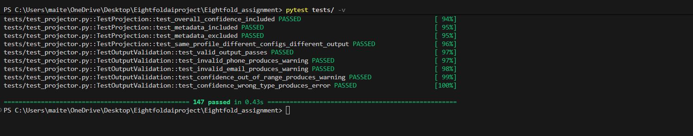
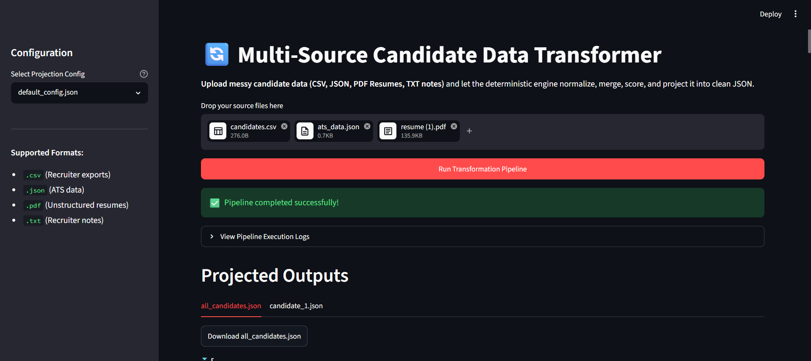

# Multi-Source Candidate Data Transformer

A deterministic, production-grade data transformation pipeline that ingests messy candidate profiles from multiple structured and unstructured sources, normalizes fields, resolves entities, merges into canonical profiles with provenance tracking and confidence scoring, and projects output according to a runtime configuration.

## Overview & Core Philosophy

This architecture is built on the philosophy that **"wrong-but-confident is worse than honestly-empty."**
- **Deterministic Extraction:** Uses rule-based parsing (regex, structure detection) with no LLM hallucinations.
- **Entity Resolution:** Uses a Union-Find algorithm to correctly group candidates across sources (e.g. matching shared emails/phones).
- **Trust-Weighted Merge:** ATS (0.9) > CSV (0.8) > Resume PDF (0.7) > Recruiter Notes (0.5).
- **Decoupled Projection:** The internal Canonical Profile is completely decoupled from the output JSON format, allowing a `config.json` to reshape the final output dynamically without altering engine code.

## 🚀 Quick Start (CLI)

Ensure you have Python 3.10+ installed.

### 1. Install Dependencies
```bash
pip install -r requirements.txt
```

### 2. Run the Pipeline
The pipeline reads all files in `--input-dir` and projects them into `--output-dir` based on the `--config`.

```bash
# Run with the default configuration
python main.py --input-dir sample_inputs/ --config sample_configs/default_config.json --output-dir output/

# Run with a custom configuration (demonstrates dynamic reshaping)
python main.py --input-dir sample_inputs/ --config sample_configs/custom_config.json --output-dir output_custom/
```

### 3. Run the Test Suite
The project includes a comprehensive `pytest` suite covering normalization edge cases, entity resolution, and projection validation.
```bash
pytest tests/ -v
```



---

## 🖥️ Web UI (Streamlit)

As an alternative to the CLI, a thin Streamlit UI wrapper is provided. This demonstrates the decoupling of the engine from the presentation layer.



```bash
# Launch the web interface
python -m streamlit run app.py
```
*Drag and drop your own CSV, JSON, TXT, or PDF Resume files directly into the browser to see the pipeline work in real-time.*

---

## 📁 Project Architecture

```text
Detect Sources → Extract (Adapters) → Normalize → Resolve Entities → Merge → Score Confidence → Project → Validate → Emit JSON
```

| Layer | Package | Responsibility |
|---|---|---|
| **Schema** | `schema/` | Data contracts (`dataclasses` internally, `pydantic` only at configuration boundaries) |
| **Adapters** | `adapters/` | Source-specific extraction (`CSVAdapter`, `ATSAdapter`, `ResumeAdapter`, `NotesAdapter`) |
| **Normalizers** | `normalizers/` | Field standardization (E.164 phones, YYYY-MM dates, ISO countries, canonical skills) |
| **Engine** | `engine/` | Entity resolution (Union-Find), merging, conflict resolution, confidence scoring, projection |
| **Validators** | `validators/` | Final output schema and data format validation |
| **Utils** | `utils/` | Shared constants, pre-compiled regex patterns, helper functions |

---

## 📄 Example Produced Output

When running with the `default_config.json`, the engine generates schema-valid JSON for each unique candidate with rich provenance and confidence data. 

*(You can find full generated files in the `output/` directory)*

```json
{
  "name": "Alexander Johnson",
  "emails": {
    "value": [
      "alex.johnson@gmail.com",
      "alex@gmail.com"
    ],
    "confidence": 0.95,
    "provenance": [
      {
        "field": "emails",
        "source_type": "ats_json",
        "source_path": "sample_inputs\\ats_data.json",
        "original_value": ["alex.johnson@gmail.com"],
        "method": "union"
      },
      {
        "field": "emails",
        "source_type": "csv",
        "source_path": "sample_inputs\\candidates.csv",
        "original_value": ["alex@gmail.com"],
        "method": "union"
      }
    ]
  },
  "phones": {
    "value": ["+15558675309"],
    "confidence": 0.9
  },
  "skills": {
    "value": ["Python", "Machine Learning", "TensorFlow"],
    "confidence": 0.9
  },
  "overall_confidence": 0.88,
  "_metadata": {
    "profile_id": "084a039c-2ff3-446e-8602-8ed734044d4d",
    "sources_used": [
      "sample_inputs\\ats_data.json",
      "sample_inputs\\candidates.csv",
      "sample_inputs\\recruiter_notes.txt"
    ]
  }
}
```

Notice how `Alexander Johnson` and `Alex Johnson` were automatically resolved as the same entity across the ATS, CSV, and TXT files, and their emails were unioned into a single array with full lineage tracking.
